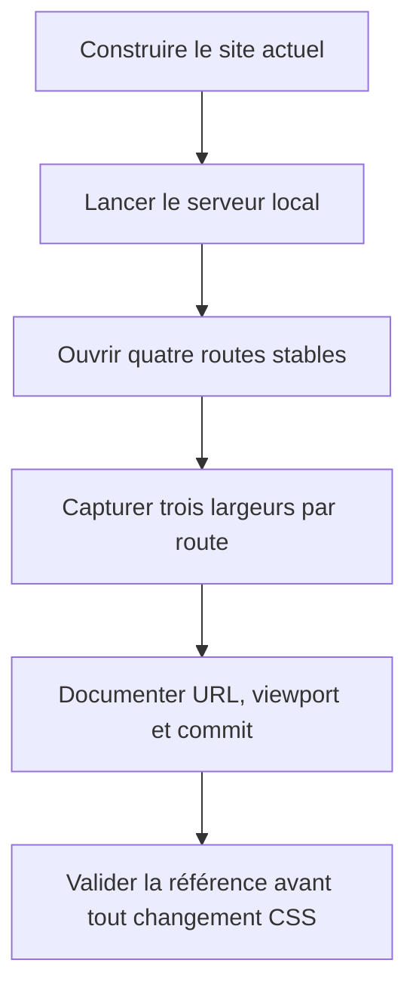
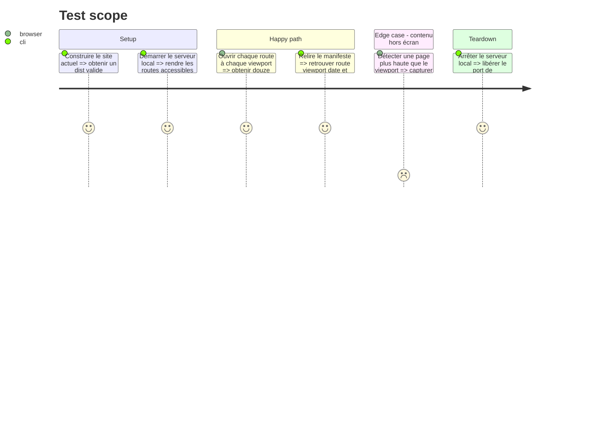

# Instruction: Figer la référence visuelle

## Architecture projection

> Tree of the final files. ✅ create · ✏️ modify · ❌ delete

```txt
nouveau-site/
└── reports/
    └── visual-baseline/
        ├── ✅ README.md
        ├── ✅ accueil-desktop.png
        ├── ✅ accueil-tablette.png
        ├── ✅ accueil-mobile.png
        ├── ✅ catalogue-desktop.png
        ├── ✅ catalogue-tablette.png
        ├── ✅ catalogue-mobile.png
        ├── ✅ livre-ville-rouge-desktop.png
        ├── ✅ livre-ville-rouge-tablette.png
        ├── ✅ livre-ville-rouge-mobile.png
        ├── ✅ collection-coquelicots-sauvages-desktop.png
        ├── ✅ collection-coquelicots-sauvages-tablette.png
        └── ✅ collection-coquelicots-sauvages-mobile.png
```

## User Journey



## Test Scope



## Tasks to do

### `1)` Préparer une construction de référence

> Produire la version exacte qui servira de comparaison aux phases suivantes.

1. Depuis `nouveau-site/`, vérifier que les dépendances sont installées.
2. Exécuter `make validate` avant toute capture.
3. Si la validation échoue avant modification, arrêter la phase et consigner l’erreur dans `reports/visual-baseline/README.md` ; ne pas corriger un problème sans rapport avec l’apparence.
4. Démarrer `make dev` uniquement après une validation verte.
5. Noter dans le manifeste le commit courant obtenu avec `git rev-parse HEAD` et l’état du dépôt obtenu avec `git status --short`.

### `2)` Capturer les routes imposées

> Utiliser les mêmes routes et viewports pour toutes les comparaisons futures.

1. Capturer `/`, `/catalogue/`, `/livres/ville-rouge/` et `/collections/coquelicots-sauvages/`.
2. Pour chaque route, capturer la page complète aux viewports suivants : desktop `1440 × 1000`, tablette `768 × 1024`, mobile `390 × 844`.
3. Attendre la fin du chargement des images avant la capture.
4. Ne pas modifier le zoom du navigateur ; le viewport doit être réel.
5. Utiliser exactement les noms de fichiers indiqués dans la projection.

### `3)` Écrire le manifeste de référence

> Rendre les captures reproductibles par une autre IA.

1. Créer `reports/visual-baseline/README.md`.
2. Documenter le commit, la date, la commande de lancement, les quatre routes, les trois viewports et la convention de nommage.
3. Indiquer que les captures sont des références, pas des maquettes à améliorer.
4. Ajouter une courte liste des éléments à surveiller : en-tête, titres, fonds, cartes, boutons, footer, largeur des textes et retours responsive.

## Test acceptance criteria

| Task | Acceptance criteria |
| ---- | ------------------- |
| 1 | `make validate` passe avant les captures, ou l’échec préexistant est documenté et la phase est arrêtée. |
| 2 | Les douze captures existent, utilisent les routes et dimensions imposées, et montrent la page complète. |
| 3 | Le manifeste permet de retrouver le commit, la route et le viewport de chaque capture sans consulter l’historique de la tâche. |
