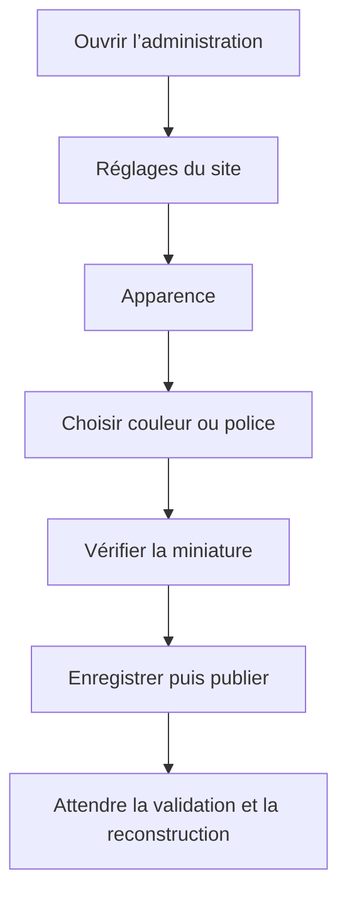
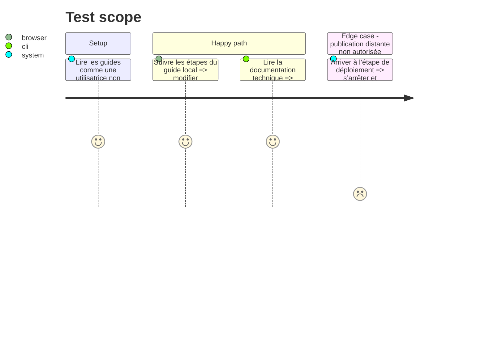

# Instruction: Documenter et préparer la livraison

## Architecture projection

> Tree of the final files. ✅ create · ✏️ modify · ❌ delete

```txt
nouveau-site/
├── ✏️ README.md
├── docs/
│   ├── ✏️ ADMINISTRATION.md
│   ├── ✏️ GUIDE-APPARENCE.md
│   ├── ✏️ GUIDE-REDACTION.md
│   └── ✏️ CONTRAT-APPARENCE.md
└── reports/
    └── visual-validation/
        └── ✏️ README.md
```

## User Journey



## Test Scope



## Tasks to do

### `1)` Écrire le guide simple pour Béatrice

> Expliquer le résultat, pas l’architecture interne.

1. Dans `GUIDE-REDACTION.md`, ajouter une section `Modifier l’apparence`.
2. Donner le parcours exact : Réglages du site → Apparence → modifier → vérifier → enregistrer → publier.
3. Expliquer en une phrase la portée de chaque couleur et police.
4. Donner les valeurs d’origine permettant une restauration manuelle sûre.
5. Préciser que la mise en page, les tailles et le responsive ne sont pas modifiables dans l’administration.
6. Expliquer que les emblèmes de collections restent dans chaque fiche Collection.

### `2)` Mettre à jour la documentation technique

> Permettre une maintenance future sans redécouvrir le pipeline.

1. Dans `GUIDE-APPARENCE.md`, documenter `apparence.json`, les tokens sémantiques et la fonction de génération CSS.
2. Dans `ADMINISTRATION.md`, ajouter Apparence à la liste des contenus modifiables et expliquer ses validations.
3. Dans `CONTRAT-APPARENCE.md`, figer la liste finale des champs, choix de polices et couleurs de rubriques.
4. Dans le README, ajouter une phrase vers les deux guides sans dupliquer les détails.

### `3)` Finaliser le rapport de validation

> Donner un état honnête de ce qui a été vérifié.

1. Lister les commandes exécutées et leurs résultats.
2. Lister les pages et viewports contrôlés.
3. Indiquer si la phase logos de rubriques a été réalisée ou volontairement différée.
4. Distinguer : code local, site généré, administration locale, GitHub Actions, aperçu OVH et production Free.
5. Ne marquer un environnement distant comme vérifié que s’il a réellement été testé dans cette phase avec autorisation.

### `4)` Préparer la livraison sans la déclencher

> Rendre la fonctionnalité prête à relire et à publier.

1. Exécuter une dernière fois `make validate`.
2. Vérifier `git diff --check`.
3. Vérifier que le diff ne contient ni secret, ni capture temporaire non prévue, ni fichier `dist` ajouté par erreur.
4. Présenter les fichiers modifiés, les tests et les limites restantes.
5. Ne pas commit, pousser ou déployer sans demande explicite de l’utilisateur.

## Test acceptance criteria

| Task | Acceptance criteria |
| ---- | ------------------- |
| 1 | Béatrice peut suivre le guide sans connaître JSON, CSS, Python ou Git. |
| 2 | Un développeur retrouve le contrat, le pipeline et les limites dans la documentation technique. |
| 3 | Le rapport sépare clairement les vérifications locales, générées et distantes. |
| 4 | La dernière validation passe et la livraison est préparée sans commit, push ni déploiement implicite. |
