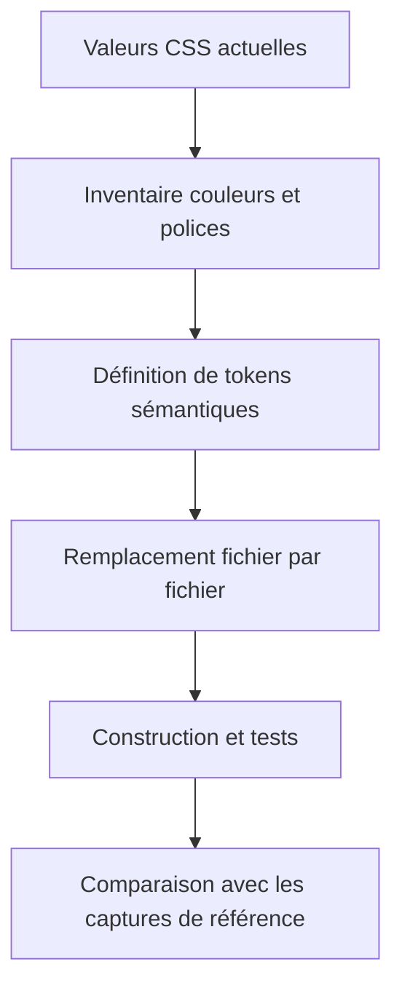
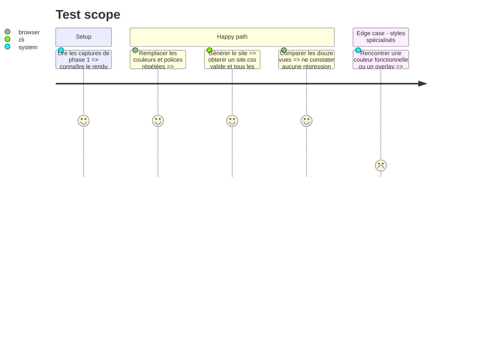

# Instruction: Centraliser les couleurs et les polices sans changer le rendu

## Architecture projection

> Tree of the final files. ✅ create · ✏️ modify · ❌ delete

```txt
nouveau-site/frontend/assets/css/
├── ✏️ 00-variables.css
├── ✏️ 01-base.css
├── ✏️ 02-typographie.css
├── ✏️ 03-mise-en-page.css
├── ✏️ 10-en-tete.css
├── ✏️ 13-boutons.css
├── ✏️ 14-textes-mis-en-avant.css
├── ✏️ 17-texte-riche.css
├── ✏️ 21-sections.css
├── ✏️ 22-accueil-commercial.css
├── ✏️ 24-cartes-maison.css
├── ✏️ 25-vitrine-collections.css
├── ✏️ 30-cartes-livre-personne.css
├── ✏️ 31-filtres-et-resultats.css
├── ✏️ 32-page-livre.css
├── ✏️ 33-galerie.css
├── ✏️ 35-pages-de-texte.css
├── ✏️ 36-actualites.css
├── ✏️ 37-projets.css
├── ✏️ 38-encart-actualites.css
├── ✏️ 39-avertissement-brouillon.css
├── ✏️ 40-pied-de-page.css
├── ✏️ 41-accueil-suivre.css
├── ✏️ 42-page-404.css
└── ✏️ 91-mobile-760px.css
```

## User Journey



## Test Scope



## Tasks to do

### `1)` Inventorier avant de remplacer

> Classer chaque valeur par rôle visuel afin d’éviter des remplacements aveugles.

1. Rechercher les couleurs avec `rg -n '#[0-9a-fA-F]{3,8}|rgba?\\(' frontend/assets/css`.
2. Rechercher les polices avec `rg -n 'font-family' frontend/assets/css`.
3. Ne pas modifier les tailles, marges, espacements, rayons responsive ou points de rupture.
4. Distinguer les couleurs de marque des couleurs fonctionnelles : alerte brouillon, overlay de galerie, ombre, contraste sur fond sombre.
5. Ne jamais remplacer deux couleurs différentes par un même token uniquement parce qu’elles se ressemblent.

### `2)` Définir les tokens dans `00-variables.css`

> Créer une API de thème stable en conservant les valeurs actuelles.

1. Ajouter au minimum : `--color-background`, `--color-surface`, `--color-text`, `--color-muted`, `--color-border`, `--color-primary`, `--color-primary-dark`, `--color-secondary`, `--color-secondary-soft`, `--color-link`, `--color-button`, `--color-highlight`, `--color-on-dark`, `--font-body`, `--font-heading`.
2. Affecter aux nouveaux tokens les valeurs exactes actuellement utilisées.
3. Conserver temporairement les anciens tokens (`--paper`, `--ink`, etc.) comme alias des nouveaux si cela permet une migration progressive sans gros diff.
4. Utiliser une pile système pour le corps et la pile Georgia existante pour les titres ; ne télécharger aucune police à cette phase.
5. Ajouter un commentaire expliquant que ces tokens sont le contrat futur de `apparence.json`.

### `3)` Migrer les usages

> Remplacer uniquement les valeurs relevant du thème global.

1. Procéder fichier par fichier dans l’ordre numérique.
2. Remplacer les piles `Inter, ui-sans-serif...` par `var(--font-body)`.
3. Remplacer `Georgia, "Times New Roman", serif` par `var(--font-heading)`.
4. Remplacer les couleurs globales par leurs tokens sémantiques.
5. Garder les accents spécifiques de collections sous `--collection-accent`, mais faire pointer leurs valeurs réutilisables vers les tokens globaux.
6. Garder les accents de cartes de la maison sous `--house-accent`.
7. Laisser les couleurs purement techniques locales si elles ne doivent jamais être administrables ; expliquer chaque exception par un commentaire court.

### `4)` Vérifier l’absence de dérive

> Prouver que la refactorisation ne change pas le produit.

1. Exécuter `make validate`.
2. Régénérer les douze vues avec les mêmes routes et viewports que la phase 1, sans écraser les références.
3. Comparer les captures avant/après.
4. En cas de différence, corriger la correspondance des tokens ; ne pas accepter une différence parce qu’elle paraît meilleure.

## Test acceptance criteria

| Task | Acceptance criteria |
| ---- | ------------------- |
| 1 | Chaque couleur ou police modifiée a un rôle identifié ; tailles et responsive ne sont pas touchés. |
| 2 | Les tokens sémantiques existent avec les valeurs visuelles actuelles et les deux piles de polices actuelles. |
| 3 | Les déclarations répétées de couleurs globales et de familles de polices utilisent les tokens, sans suppression des accents spécifiques nécessaires. |
| 4 | `make validate` passe et les douze comparaisons ne montrent aucune différence visible. |
