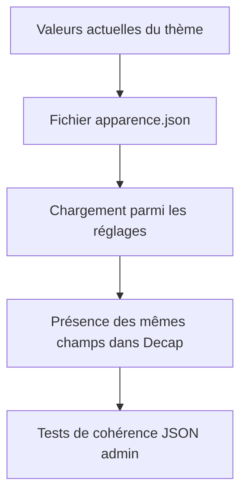
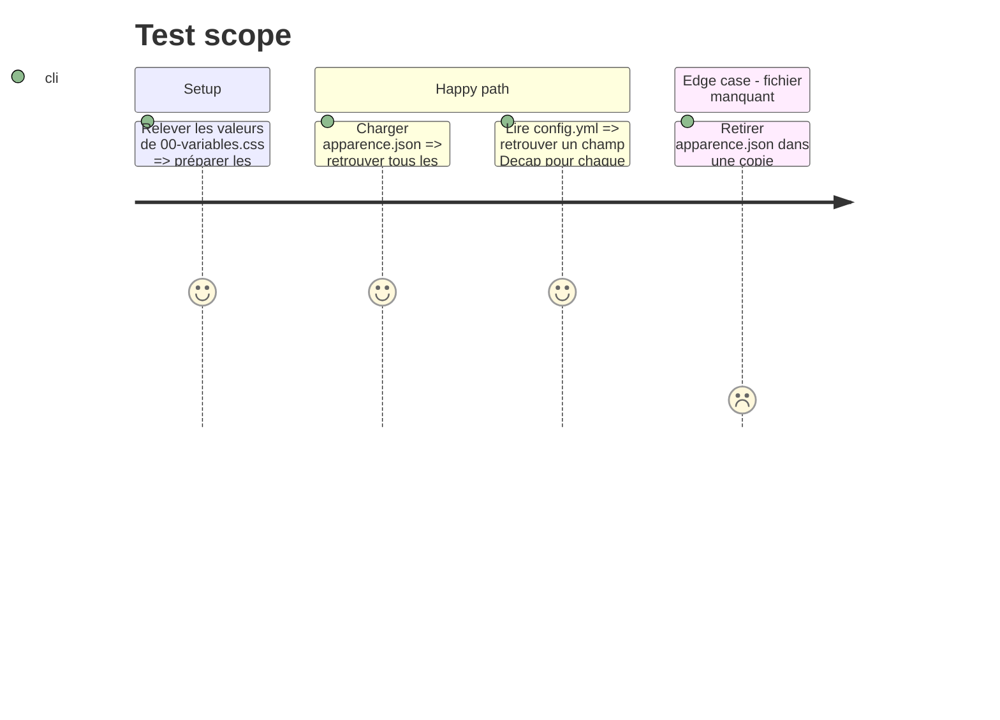

# Instruction: Créer le contrat de données Apparence

## Architecture projection

> Tree of the final files. ✅ create · ✏️ modify · ❌ delete

```txt
nouveau-site/
├── content/
│   ├── ✏️ schema.json
│   └── reglages/
│       └── ✅ apparence.json
├── frontend/admin/
│   └── ✏️ config.yml
├── tools/
│   ├── ✏️ content_data.py
│   ├── ✏️ test_content_data.py
│   └── ✏️ test_built_site.py
└── docs/
    └── ✅ CONTRAT-APPARENCE.md
```

## User Journey



## Test Scope



## Tasks to do

### `1)` Écrire le contrat avant le comportement

> Fixer les noms, valeurs et responsabilités que les phases suivantes devront respecter.

1. Créer `docs/CONTRAT-APPARENCE.md`.
2. Décrire chaque champ, son rôle CSS, son type, sa valeur par défaut et ses valeurs autorisées.
3. Utiliser les clés : `couleurFond`, `couleurSurface`, `couleurTexte`, `couleurTexteSecondaire`, `couleurPrincipale`, `couleurPrincipaleFoncee`, `couleurSecondaire`, `couleurLiens`, `couleurBoutons`, `policeTitres`, `policeTexte`.
4. Définir les identifiants de polices comme des choix abstraits, jamais comme du CSS brut : `serif-classique`, `sans-serif-moderne`, et les autres choix seulement s’ils ont une pile CSS définie dans le code.
5. Interdire explicitement les propriétés de mise en page, URL de police, règles CSS, valeurs avec `;`, accolades ou fonctions CSS.

### `2)` Créer `apparence.json`

> Initialiser le réglage avec le rendu actuel, sans effet visuel à cette phase.

1. Créer un objet JSON contenant exactement les clés du contrat.
2. Reprendre les valeurs de la phase 2 afin que le thème par défaut soit inchangé.
3. Utiliser uniquement des couleurs hexadécimales opaques au format `#RRGGBB`.
4. Ne pas ajouter de logo ou de média dans ce fichier.

### `3)` Brancher le nouveau fichier dans les réglages

> Faire reconnaître le fichier comme un réglage de premier niveau.

1. Ajouter `apparence` à `SETTING_FILES` dans `tools/content_data.py`.
2. Ajouter une section de schéma descriptive dans `content/schema.json` et incrémenter sa version.
3. Ajouter l’entrée de fichier `apparence` dans la collection `reglages` de `frontend/admin/config.yml` avec un champ par clé JSON.
4. À cette phase, utiliser des champs simples et sûrs ; le confort visuel final est traité en phase 6.
5. Mettre `editor.preview: false` sur l’entrée Apparence tant que la phase 7 n’est pas réalisée.

### `4)` Mettre à jour les tests de structure

> Empêcher toute divergence future entre JSON, chargeur et administration.

1. Mettre à jour l’ensemble exact attendu par `test_settings_and_fixed_pages_are_present`.
2. Mettre à jour la version de schéma attendue par `test_content_schema_and_required_records` pour correspondre à la version inscrite dans `content/schema.json`.
3. Conserver le test qui exige que toutes les clés JSON soient exposées dans Decap.
4. Ajouter un test qui vérifie que `settings["apparence"]` est un objet et possède exactement les clés du contrat.
5. Ne pas tester encore la génération CSS, réservée à la phase 5.

## Test acceptance criteria

| Task | Acceptance criteria |
| ---- | ------------------- |
| 1 | Le contrat documente chaque champ, sa valeur par défaut et son domaine autorisé sans laisser de choix implicite. |
| 2 | `apparence.json` contient uniquement les clés prévues et reproduit le thème actuel. |
| 3 | Le chargeur et Decap reconnaissent le fichier sans modifier le CSS généré. |
| 4 | Les tests de structure passent et échouent si une clé JSON n’est plus exposée dans Decap. |
