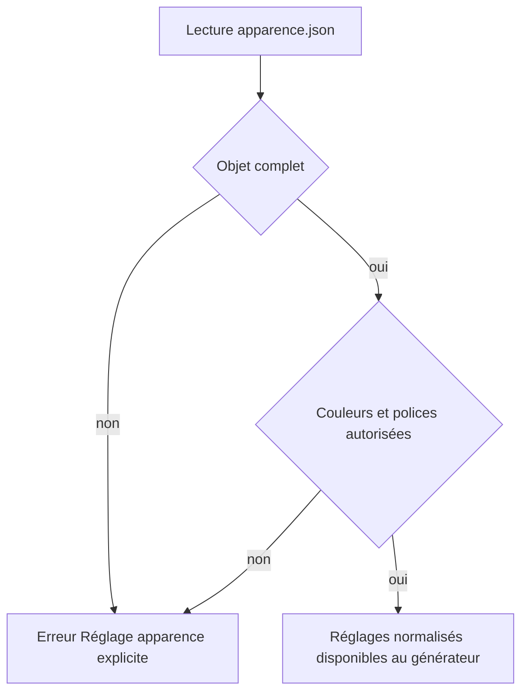
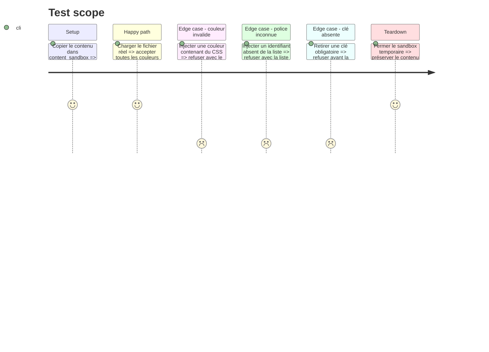

# Instruction: Valider et sécuriser les réglages Apparence

## Architecture projection

> Tree of the final files. ✅ create · ✏️ modify · ❌ delete

```txt
nouveau-site/tools/
├── ✏️ content_data.py
└── ✏️ test_content_data.py
```

## User Journey



## Test Scope



## Tasks to do

### `1)` Définir les constantes de validation

> Rassembler le contrat de sécurité en un seul endroit lisible.

1. Ajouter une expression régulière stricte pour `#RRGGBB` uniquement.
2. Ajouter un dictionnaire immuable des polices autorisées vers leurs piles CSS internes.
3. Ajouter la liste ordonnée des champs couleur obligatoires.
4. Ne jamais accepter une pile de police directement depuis le JSON.
5. Ne jamais accepter `rgb()`, `url()`, `var()`, alpha, point-virgule ou accolade dans une couleur administrable.

### `2)` Ajouter `validate_appearance_settings`

> Refuser les données dangereuses ou incomplètes avant tout rendu.

1. Vérifier que le bloc est un objet.
2. Vérifier que son ensemble de clés est exactement celui du contrat ; signaler séparément les clés manquantes et inconnues.
3. Vérifier chaque couleur avec l’expression stricte.
4. Vérifier `policeTitres` et `policeTexte` contre les identifiants autorisés.
5. Produire des messages commençant par `Réglage apparence:` et nommant le champ fautif.
6. Appeler cette fonction depuis `validate_settings`.

### `3)` Tester toutes les frontières

> Donner à une future IA des exemples exécutables des valeurs acceptées et refusées.

1. Ajouter un test nominal sur le fichier réel.
2. Ajouter des sous-tests pour chaîne vide, hexadécimal court, alpha, fonction CSS, point-virgule, accolade, valeur non chaîne et police inconnue.
3. Ajouter un test pour clé absente et un pour clé supplémentaire.
4. Utiliser `content_sandbox`; ne jamais modifier les vrais réglages pendant les tests.
5. Vérifier un fragment stable du message d’erreur, pas toute la phrase si cela rend le test fragile.

## Test acceptance criteria

| Task | Acceptance criteria |
| ---- | ------------------- |
| 1 | Les domaines autorisés sont centralisés et aucune valeur CSS arbitraire n’est acceptée. |
| 2 | Toute donnée invalide déclenche `ContentError` avec `Réglage apparence` et le nom du champ. |
| 3 | Les cas nominaux et toutes les frontières listées disposent d’un test reproductible qui passe. |
