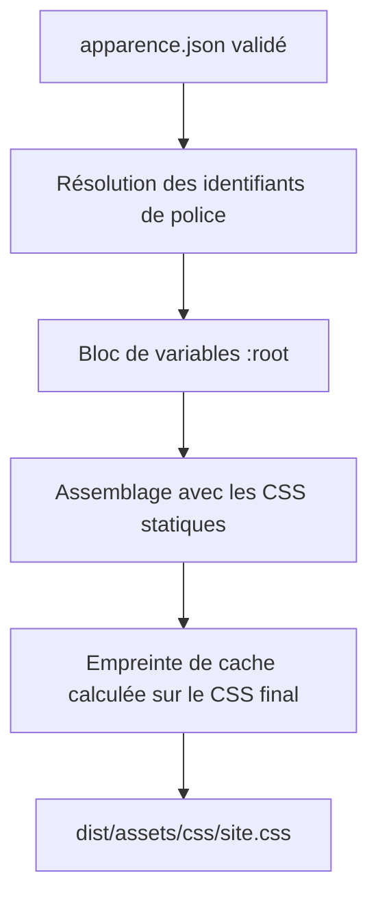
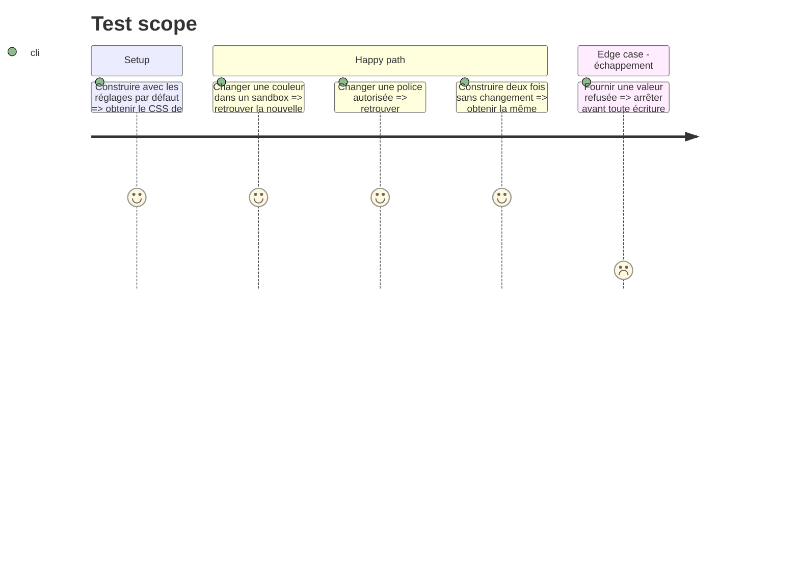

# Instruction: Générer le thème CSS depuis les réglages

## Architecture projection

> Tree of the final files. ✅ create · ✏️ modify · ❌ delete

```txt
nouveau-site/tools/
├── ✏️ rendu/feuille_de_style.py
├── ✏️ rendu/constructeur.py
├── ✏️ rendu/sortie.py
├── ✏️ test_content_data.py
└── ✏️ test_built_site.py
```

## User Journey



## Test Scope



## Tasks to do

### `1)` Créer un rendu CSS déterministe

> Convertir les réglages validés en déclarations internes sans concaténer de CSS utilisateur.

1. Dans `feuille_de_style.py`, créer une fonction pure qui reçoit le dictionnaire Apparence validé.
2. Mapper explicitement chaque clé JSON vers un token CSS connu.
3. Résoudre les identifiants de polices grâce au dictionnaire interne défini en phase 4.
4. Produire un bloc `:root` dans un ordre stable.
5. Ne jamais transformer une clé JSON inconnue en nom de propriété CSS.
6. Faire terminer le bloc par une ligne vide avant le CSS statique.

### `2)` Assembler une seule source CSS finale

> Éviter que le CSS écrit dans `dist` et celui utilisé pour l’empreinte divergent.

1. Faire accepter les réglages Apparence à `assembler_css` ou créer une fonction unique `feuille_de_style_complete`.
2. Appeler cette même fonction depuis `constructeur.py` pour `asset_version`.
3. Appeler cette même fonction depuis `sortie.py` pour écrire `site.css`.
4. Ne pas recalculer le bloc de thème avec deux implémentations différentes.
5. Conserver l’ordre numérique des fichiers CSS statiques après le bloc généré.

### `3)` Brancher les réglages du constructeur

> Rendre le thème disponible après chargement et validation du contenu.

1. Dans `SiteBuilder.__init__`, récupérer `self.settings["apparence"]` après `load_content`.
2. Calculer l’empreinte seulement après disponibilité des réglages.
3. Vérifier que modifier uniquement une couleur change `asset_version`.
4. Vérifier que les valeurs par défaut produisent le même rendu que la fin de phase 2.

### `4)` Ajouter les tests de génération

> Prouver la relation entre JSON, CSS final et cache navigateur.

1. Tester la fonction pure avec un dictionnaire connu.
2. Construire dans un dossier temporaire avec une couleur modifiée.
3. Vérifier la présence de la valeur dans `site.css` et l’absence de clé JSON brute comme propriété CSS.
4. Vérifier qu’une modification du thème modifie l’empreinte des assets.
5. Vérifier que `make validate` reste vert avec les données réelles.

## Test acceptance criteria

| Task | Acceptance criteria |
| ---- | ------------------- |
| 1 | Le bloc généré contient uniquement les tokens connus, dans un ordre déterministe, avec des valeurs déjà validées. |
| 2 | L’empreinte de cache et le fichier publié proviennent exactement de la même chaîne CSS finale. |
| 3 | Une modification autorisée change le thème et la version d’asset sans toucher au HTML des pages. |
| 4 | Les tests prouvent les couleurs, les polices, l’empreinte et le fonctionnement complet de `make validate`. |
