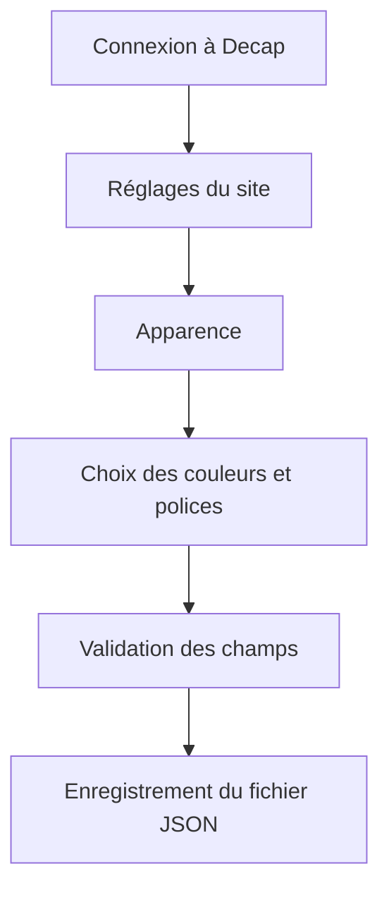
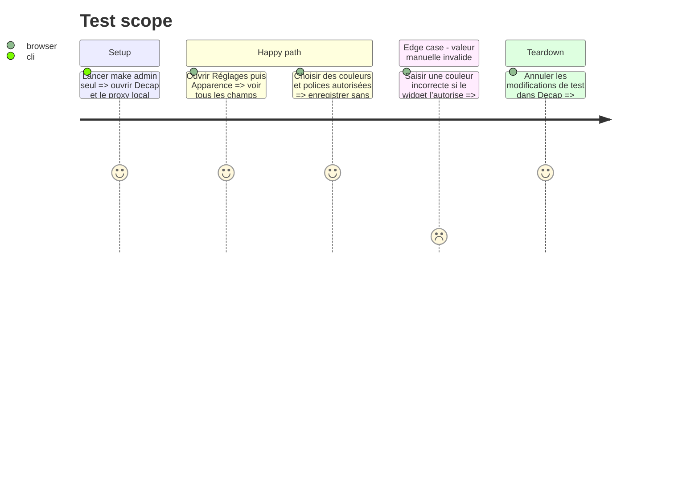

# Instruction: Finaliser l’interface Apparence dans Decap CMS

## Architecture projection

> Tree of the final files. ✅ create · ✏️ modify · ❌ delete

```txt
nouveau-site/
├── frontend/admin/
│   ├── ✏️ config.yml
│   └── ✏️ admin.css
└── tools/
    └── ✏️ test_built_site.py
```

## User Journey



## Test Scope



## Wireframe

```txt
┌────────────────────────────────────────────────────────────┐
│ (1) Réglages du site > Apparence                           │
├─────────────────────────────┬──────────────────────────────┤
│ (2) Couleurs               │ (4) Aide                     │
│ Fond            [sélecteur]│ Ces choix modifient          │
│ Surface         [sélecteur]│ l’ensemble du site.          │
│ Texte           [sélecteur]│                              │
│ Principale      [sélecteur]│ Aucun CSS à saisir.          │
│ Secondaire      [sélecteur]│                              │
│ Liens           [sélecteur]│                              │
│ Boutons         [sélecteur]│                              │
├─────────────────────────────┤                              │
│ (3) Polices                │                              │
│ Titres          [choix  ▾] │                              │
│ Textes          [choix  ▾] │                              │
├─────────────────────────────┴──────────────────────────────┤
│ (5) Enregistrer                                            │
└────────────────────────────────────────────────────────────┘
```

1. En-tête : situe le réglage dans l’administration.
2. Couleurs : un champ par rôle visuel autorisé.
3. Polices : listes fermées utilisant des noms compréhensibles.
4. Aide : explique la portée et l’absence de CSS libre.
5. Enregistrement : utilise le mécanisme éditorial Decap existant.

## Tasks to do

### `1)` Donner des libellés non techniques

> Permettre à Béatrice de comprendre chaque choix sans connaître le CSS.

1. Nommer l’entrée `Apparence` sous `Réglages du site`.
2. Utiliser les libellés `Fond du site`, `Fond des cartes`, `Texte principal`, `Texte secondaire`, `Couleur principale`, `Couleur principale foncée`, `Couleur secondaire`, `Liens`, `Boutons`, `Police des titres`, `Police des textes`.
3. Ajouter un `hint` court à chaque champ ambigu.
4. Ne jamais afficher les noms de tokens CSS dans les libellés.
5. Ajouter une description générale indiquant que les tailles et la mise en page restent protégées.

### `2)` Configurer des contrôles fermés

> Empêcher l’administration de produire une valeur hors contrat.

1. Pour les polices, utiliser `widget: select` avec des options `{label, value}` correspondant exactement au contrat.
2. Pour les couleurs, utiliser le widget couleur disponible dans la version Decap embarquée s’il écrit bien `#RRGGBB` sans alpha.
3. Vérifier ce comportement dans l’administration locale avant de conserver le widget.
4. Si le widget embarqué ne garantit pas ce format, utiliser `widget: string` avec le motif `^#[0-9A-Fa-f]{6}$` ; ne pas ajouter de dépendance externe.
5. Ne pas ajouter de champ CSS, URL de police ou taille libre.

### `3)` Ne pas simuler un bouton de restauration non fiable

> Garder une action reproductible plutôt qu’un faux bouton.

1. Ne créer un bouton `Restaurer les valeurs d’origine` que si Decap permet de remettre toutes les valeurs de l’entrée sans code fragile.
2. Sinon, documenter les valeurs d’origine dans les hints et dans le guide utilisateur.
3. Ne jamais effacer `apparence.json` pour restaurer le thème.

### `4)` Tester la configuration publiée

> Vérifier le YAML copié dans `dist/admin`, pas seulement le fichier source.

1. Étendre les tests de `test_built_site.py` pour identifier l’entrée `reglages/apparence`.
2. Vérifier l’ensemble exact des champs, les widgets select des polices et leurs valeurs.
3. Vérifier que chaque champ couleur porte un contrôle ou un motif compatible avec le contrat.
4. Vérifier qu’aucun champ nommé `css`, `style`, `urlPolice` ou équivalent n’existe.

## Test acceptance criteria

| Task | Acceptance criteria |
| ---- | ------------------- |
| 1 | Une personne non technique comprend le rôle de chaque champ sans voir de nom CSS. |
| 2 | L’administration ne propose que des polices autorisées et ne peut enregistrer que des couleurs `#RRGGBB`. |
| 3 | Aucune action de restauration trompeuse ou destructrice n’est affichée. |
| 4 | Les tests inspectent la configuration réellement publiée et interdisent tout champ de CSS libre. |
