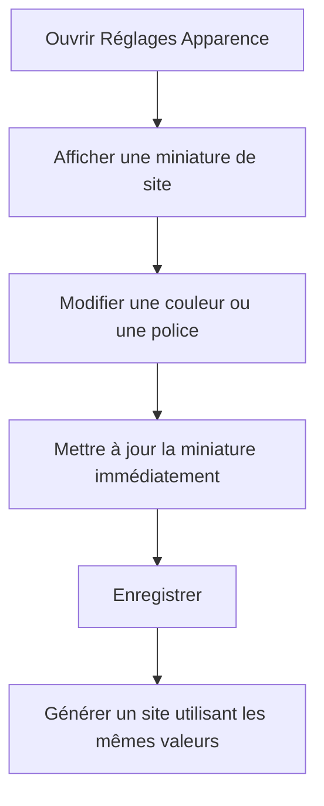
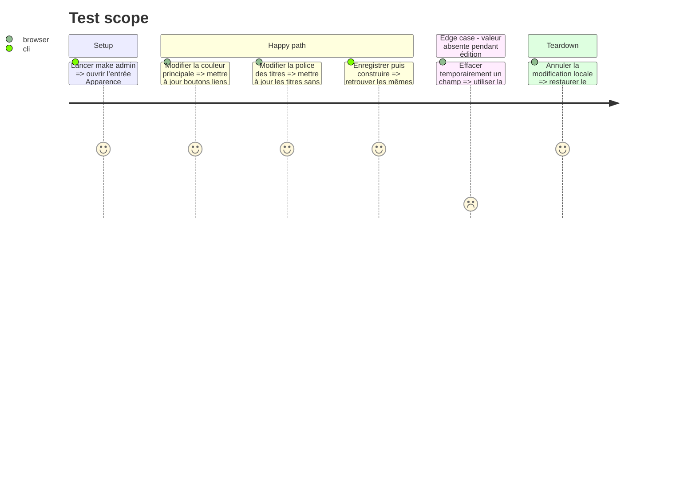

# Instruction: Synchroniser l’aperçu Apparence de l’administration

## Architecture projection

> Tree of the final files. ✅ create · ✏️ modify · ❌ delete

```txt
nouveau-site/
├── frontend/admin/
│   ├── ✏️ config.yml
│   ├── ✏️ preview.js
│   └── ✏️ preview.css
└── tools/
    └── ✏️ test_built_site.py
```

## User Journey



## Test Scope



## Wireframe

```txt
┌───────────────────────────────────────────────────────────┐
│ (1) Aperçu du thème                                      │
├───────────────────────────────────────────────────────────┤
│ (2) En-tête · nom de la maison · lien                    │
├───────────────────────────────────────────────────────────┤
│ (3) Grand titre dans la police choisie                   │
│     Texte courant dans la police choisie                 │
│                                                         │
│     [Bouton principal]   lien secondaire                 │
├───────────────────────────────┬───────────────────────────┤
│ (4) Carte sur fond surface    │ (5) Bloc secondaire      │
│ Titre · texte secondaire      │ Couleur secondaire       │
└───────────────────────────────┴───────────────────────────┘
```

1. Aperçu : miniature dédiée au réglage Apparence.
2. En-tête : montre fond, texte et liens.
3. Contenu : montre les deux familles de police et la couleur principale.
4. Carte : montre surface, bordure et texte secondaire.
5. Bloc secondaire : montre la couleur secondaire et le contraste.

## Tasks to do

### `1)` Créer un aperçu dédié à l’entrée Apparence

> Montrer les effets des réglages sans dépendre d’une autre fiche Decap.

1. Retirer `editor.preview: false` uniquement de l’entrée Apparence.
2. Dans `preview.js`, créer `AppearancePreview` qui lit directement les valeurs de l’entrée en cours.
3. Enregistrer ce template sous le nom exact du fichier Decap `apparence`.
4. Ne pas tenter de lire silencieusement une autre entrée Decap depuis les aperçus Livres ou Pages : l’API actuelle ne garantit pas ce couplage.
5. Utiliser les valeurs par défaut du contrat si un champ est vide pendant la saisie.

### `2)` Appliquer les variables à la miniature

> Réutiliser le même mapping conceptuel que le générateur.

1. Affecter les valeurs de l’entrée à des propriétés CSS personnalisées sur le conteneur racine de la miniature.
2. Mapper les identifiants de police dans une table JavaScript fermée identique au contrat Python.
3. N’utiliser aucune valeur comme chaîne de règle CSS complète.
4. Ajouter dans `preview.css` des styles limités à `.appearance-preview`.
5. Montrer tous les rôles importants : fond, surface, texte, texte secondaire, principale, secondaire, lien, bouton et deux polices.

### `3)` Aligner les aperçus de contenu sur les tokens par défaut

> Éliminer les couleurs et familles de polices codées en dur quand elles correspondent au thème.

1. Ajouter en tête de `preview.css` les mêmes tokens avec les valeurs par défaut.
2. Remplacer dans les aperçus existants les couleurs et piles globales par ces tokens.
3. Conserver les styles structurels propres à l’aperçu.
4. Documenter clairement que les aperçus des autres fiches utilisent le thème enregistré, tandis que l’aperçu Apparence montre les modifications en cours.

### `4)` Protéger les enregistrements de templates

> Éviter une collision entre nom de fichier de réglage et rubrique de contenu.

1. Étendre le test `test_no_preview_template_can_be_applied_to_the_wrong_entry` pour autoriser explicitement `apparence` uniquement sur cette entrée.
2. Vérifier que `preview.js` contient l’enregistrement du template Apparence.
3. Vérifier que l’entrée Apparence n’a plus `preview: false`.
4. Tester manuellement l’absence d’erreur dans la console du navigateur.

## Test acceptance criteria

| Task | Acceptance criteria |
| ---- | ------------------- |
| 1 | L’entrée Apparence affiche une miniature dédiée et les autres entrées gardent leurs aperçus actuels. |
| 2 | Toute modification autorisée est visible immédiatement dans la miniature sans CSS arbitraire. |
| 3 | Les aperçus de contenu utilisent les mêmes tokens et valeurs par défaut que le site. |
| 4 | Aucun conflit de template ni erreur JavaScript n’apparaît dans Decap local. |
