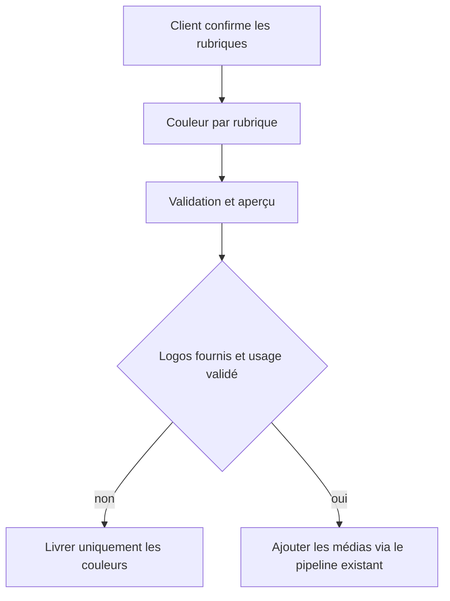
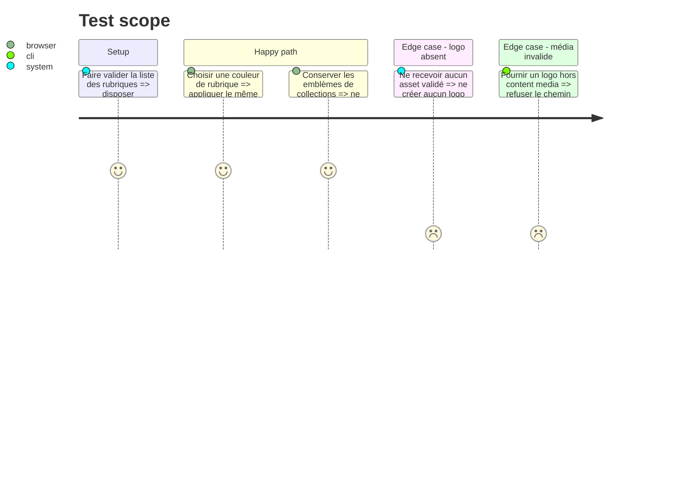

# Instruction: Ajouter l’identité des rubriques sans inventer de logos

## Architecture projection

> Tree of the final files. ✅ create · ✏️ modify · ❌ delete

```txt
nouveau-site/
├── content/reglages/
│   └── ✏️ apparence.json
├── content/
│   └── ✏️ schema.json
├── frontend/admin/
│   ├── ✏️ config.yml
│   ├── ✏️ preview.js
│   └── ✏️ preview.css
├── frontend/assets/css/
│   └── ✏️ 00-variables.css
├── tools/
│   ├── ✏️ content_data.py
│   ├── ✏️ test_content_data.py
│   ├── ✏️ test_built_site.py
│   └── rendu/
│       ├── ✏️ feuille_de_style.py
│       └── ✏️ medias.py seulement si des logos validés sont fournis
└── docs/
    └── ✏️ CONTRAT-APPARENCE.md
```

## User Journey



## Test Scope



## Tasks to do

### `1)` Obtenir une décision produit explicite

> Ne pas attribuer arbitrairement une identité à des rubriques.

1. Faire confirmer la liste : accueil, catalogue, personnes, collections, actualités, maison et pages éditoriales.
2. Faire confirmer si `pages éditoriales` partage une couleur ou reçoit une couleur par page.
3. Faire confirmer si le mot `logo` signifie une vraie image fournie, une icône existante ou seulement une couleur.
4. Si la réponse manque, implémenter uniquement les couleurs de la liste validée et arrêter la partie médias.

### `2)` Ajouter les couleurs de rubriques au contrat

> Utiliser des identifiants stables, pas des sélecteurs CSS saisis par le client.

1. Ajouter un objet fermé `couleursRubriques` à `apparence.json`.
2. Utiliser une clé par rubrique validée et une valeur `#RRGGBB`.
3. Valider l’ensemble exact des clés et chaque couleur.
4. Générer des tokens tels que `--color-section-catalogue` depuis un mapping interne.
5. Connecter ces tokens aux classes existantes des pages ; ne pas générer de sélecteur depuis le JSON.
6. Ajouter les champs Decap et leur représentation dans `AppearancePreview`.

### `3)` Préserver les emblèmes de collections

> Éviter une régression sur une fonctionnalité déjà disponible.

1. Ne pas déplacer `logo` et `logoAlt` hors des fiches Collections.
2. Vérifier que `vitrine_collections.py`, `pages/collections.py` et `medias.py` continuent d’utiliser ces champs.
3. Vérifier que l’aperçu Collection montre toujours l’emblème.

### `4)` Ajouter les logos de rubriques seulement si les assets existent

> Réutiliser le pipeline de médias au lieu de servir des fichiers bruts.

1. Exiger une image source et une description alternative pour chaque logo retenu.
2. Stocker les sources sous `content/media/` et les référencer par des chemins validés.
3. Étendre `validate_media`, le recensement des médias et l’optimisation existante ; ne pas copier directement un fichier vers `dist`.
4. Définir les dimensions de sortie et les emplacements HTML avant de coder.
5. Ajouter les tests de médias orphelins, d’alt obligatoire et de sortie WebP.
6. Ne pas traiter le logo principal du site dans cette phase.

## Test acceptance criteria

| Task | Acceptance criteria |
| ---- | ------------------- |
| 1 | La liste des rubriques et la signification de « logo » sont documentées ; aucune décision visuelle n’est inventée. |
| 2 | Chaque rubrique validée peut recevoir une couleur sûre, générée via un token connu et visible dans l’aperçu. |
| 3 | Les emblèmes actuels des collections restent modifiables et affichés comme avant. |
| 4 | Sans assets validés aucun logo n’est créé ; avec assets, chaque image passe par validation, optimisation et tests. |
