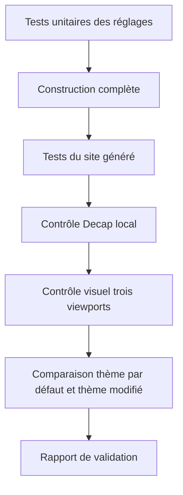
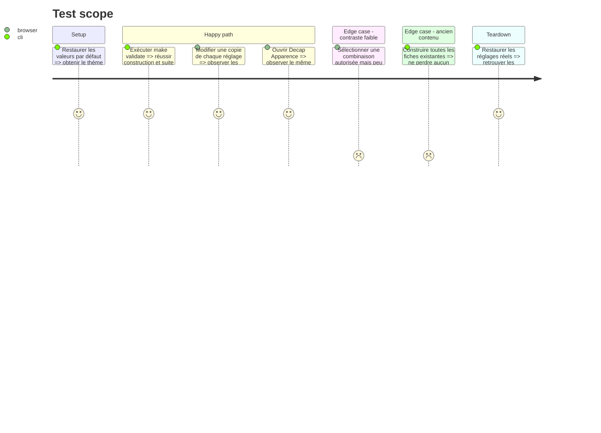

# Instruction: Tester le comportement et le rendu complet

## Architecture projection

> Tree of the final files. ✅ create · ✏️ modify · ❌ delete

```txt
nouveau-site/
├── tools/
│   ├── ✏️ test_content_data.py
│   ├── ✏️ test_built_site.py
│   └── ✏️ test_deploy.py seulement si le contenu publié change le contrat de déploiement
└── reports/
    └── visual-validation/
        ├── ✅ README.md
        └── ✅ captures finales desktop tablette mobile
```

## User Journey



## Test Scope



## Tasks to do

### `1)` Compléter la matrice de tests automatiques

> Couvrir chaque contrat introduit par les phases précédentes.

1. Couvrir couleurs valides et invalides.
2. Couvrir toutes les polices autorisées et une police inconnue.
3. Couvrir clés manquantes et supplémentaires.
4. Couvrir le bloc CSS généré, son ordre et l’empreinte d’asset.
5. Couvrir la cohérence JSON ↔ Decap.
6. Couvrir les couleurs de rubriques si la phase 8 les a implémentées.
7. Couvrir les médias de rubriques uniquement s’ils existent.

### `2)` Exécuter les validations du projet

> Distinguer précisément ce qui est prouvé.

1. Exécuter `make validate` depuis `nouveau-site/`.
2. Consigner le nombre de tests réussis et tout avertissement dans `reports/visual-validation/README.md`.
3. Ne pas affirmer qu’un test local prouve le déploiement distant.
4. En cas d’échec, corriger uniquement une régression liée au thème ; consigner les échecs préexistants séparément.

### `3)` Réaliser deux campagnes visuelles

> Vérifier le thème par défaut puis un thème de démonstration clairement temporaire.

1. Avec les valeurs par défaut, reprendre les quatre routes et trois viewports de phase 1.
2. Comparer au pixel ou visuellement chaque capture à la référence.
3. Dans un sandbox ou une branche de travail, appliquer un thème de test contrasté.
4. Vérifier que les changements restent limités aux rôles autorisés et que la mise en page ne bouge pas.
5. Vérifier en particulier menu mobile, boutons, liens, cartes, footer, texte riche et états focus.
6. Restaurer les valeurs réelles après la campagne.

### `4)` Vérifier l’administration

> Tester le parcours réel de Béatrice.

1. Arrêter tout `make dev` avant `make admin`, car `make admin` lance déjà le serveur.
2. Ouvrir Apparence, modifier chaque type de champ et vérifier la miniature.
3. Enregistrer localement et vérifier le JSON produit.
4. Construire et comparer le site au même choix.
5. Annuler les modifications de test et vérifier un dépôt propre hors fichiers préexistants.

## Test acceptance criteria

| Task | Acceptance criteria |
| ---- | ------------------- |
| 1 | Chaque règle du contrat possède au moins un test nominal et les cas invalides importants sont couverts. |
| 2 | `make validate` passe ; le rapport distingue explicitement validation locale et déploiement. |
| 3 | Le thème par défaut reste identique et le thème de test ne modifie que couleurs et polices prévues aux trois viewports. |
| 4 | Le parcours Decap produit un JSON valide, un aperçu cohérent et le même résultat après génération. |
